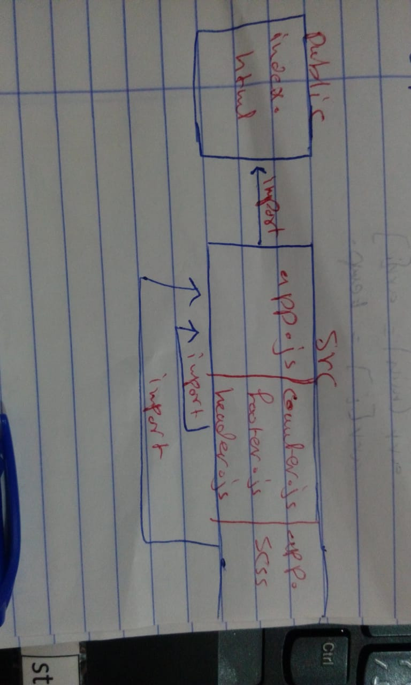

# LAB - Class 26

##  Component Based UI

### Author: Saja Swalgah

### Links and Resources

- [submission PR](https://github.com/Saja-401-advanced-javascript/class-26/pull/1)

#### How to initialize/run your application (where applicable)

-  `npm run start`

#### UML

.